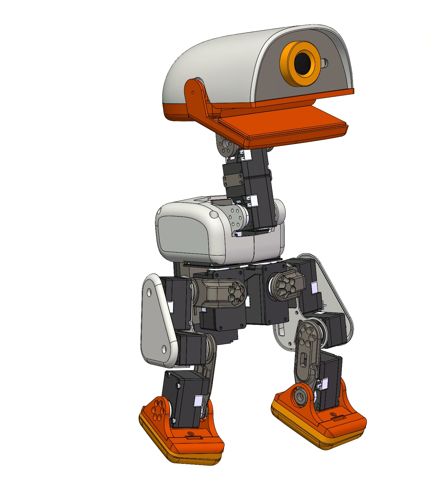
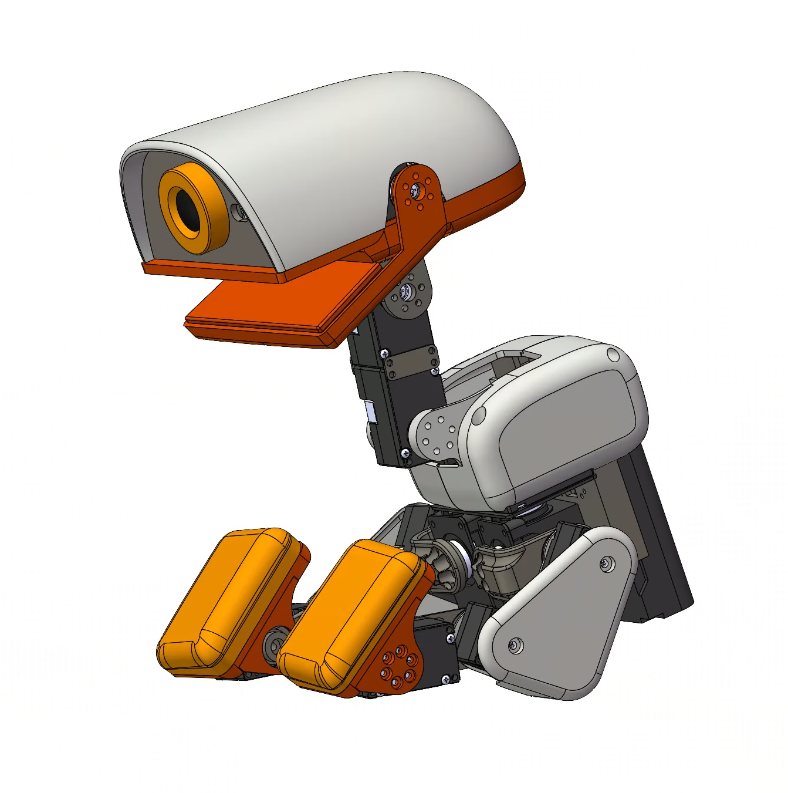
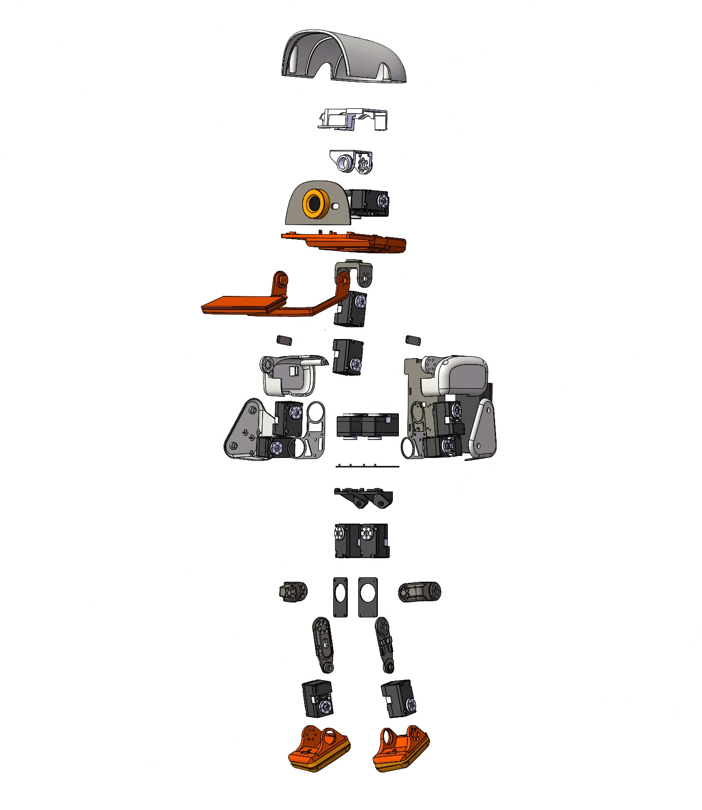
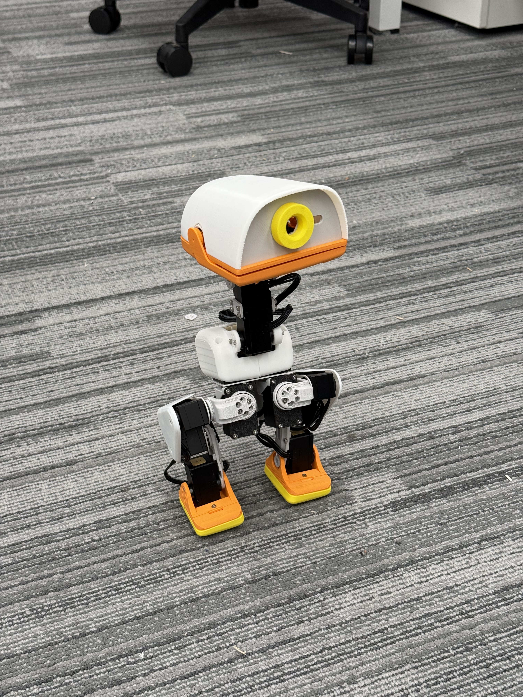

# MicroDuck 3D Model Recreation / MicroDuck 个人复刻模型



这是一个由个人玩家 `laotawayer` 独立复刻和维护的 MicroDuck 3D 模型仓库，提供 SolidWorks 源文件与通用 STEP 导出文件。

This repository contains an independent hobbyist recreation of the MicroDuck 3D model, including SolidWorks source files and a STEP export.

## Preview / 模型预览

| Sitting pose / 坐姿 | Exploded view / 爆炸图 |
| --- | --- |
|  |  |

## Physical Build / 实物照片



实物照片用于展示当前装配状态；照片中的配色、线缆和装配细节可能与仓库中的 CAD 源文件存在差异。

The physical photo shows an assembled build in its current state. Colors, wiring, and assembly details in the photo may differ from the CAD source files.

## Repository Contents / 仓库内容

```text
cad/solidworks/   SolidWorks parts and assemblies / 零件与装配体源文件
exports/step/     STEP exchange files / STEP 交换文件
images/           Preview renders / 模型预览图
CHANGELOG.md      Version history / 版本变更记录
DISCLAIMER.md     Legal and non-affiliation notice / 免责声明
LICENSE.md        Restrictive source-available terms / 限制性许可条款
VERSION           Current model version / 当前模型版本
models.sha256     Model integrity checksums / 模型校验值
```

- Main assembly / 主要装配体：`cad/solidworks/microduck.SLDASM`
- Full STEP export / 整机 STEP：`exports/step/microduck.STEP`
- Full SolidWorks source package / 完整 SolidWorks 源文件包：[microduck-v0.1.0-solidworks-source.zip](https://github.com/laotawayer/microduck/releases/download/v0.1.0/microduck-v0.1.0-solidworks-source.zip)
- Current version / 当前版本：`0.1.0`
- CAD software / 建模软件：SolidWorks 2023（SW23）
- Units / 尺寸单位：待作者确认 / To be confirmed
- Manufacturing validation / 制造验证：待作者补充 / Not yet documented

## Reference Parts / 参考件

仓库中的轴承、紧固件、电路板、舵机或其他商品化部件模型可能仅用于装配定位和尺寸参考，其权利归各自权利人所有。

Bearings, fasteners, PCBs, servos, and other commercial components may be included solely as assembly references and remain subject to their respective owners' rights.

## Use and Safety / 使用与安全

在加工、打印或装配前，请自行核对尺寸、公差、材料、载荷、电气安全和运动干涉。本模型按现状提供，不构成制造、安全或特定用途保证。

Before fabrication, printing, or assembly, independently verify dimensions, tolerances, materials, loads, electrical safety, and mechanical interference. The files are provided as-is without a manufacturing, safety, or fitness guarantee.

> [!NOTE]
> GitHub's repository ZIP may show CAD files as small Git LFS pointer files. To download the actual SolidWorks files, use the complete source package in the Release link above.

## License / 许可

本仓库采用严格的定制源码可查看许可，并非 OSI 定义的开源许可证。未经作者事先书面授权，禁止商业使用、制造销售、修改、二次创作、再发布、转换后发布以及以本模型训练数据集或模型。公开访问仓库不代表授予上述权利。

This repository uses a restrictive custom source-available license and is not open source under the OSI definition. Commercial use, fabrication for sale, modification, derivative works, redistribution, republishing converted files, and use as training data are prohibited without the author's prior written permission. Public access does not grant those rights.

完整条款见 [LICENSE.md](LICENSE.md)，身份与第三方权利说明见 [DISCLAIMER.md](DISCLAIMER.md)。

See [LICENSE.md](LICENSE.md) for the binding terms and [DISCLAIMER.md](DISCLAIMER.md) for non-affiliation and third-party notices.

## Keywords

MicroDuck, robotics, robot design, CAD, SolidWorks 2023, STEP, 3D model, hobby robot, 机器人复刻, 三维模型, 舵机机器人
